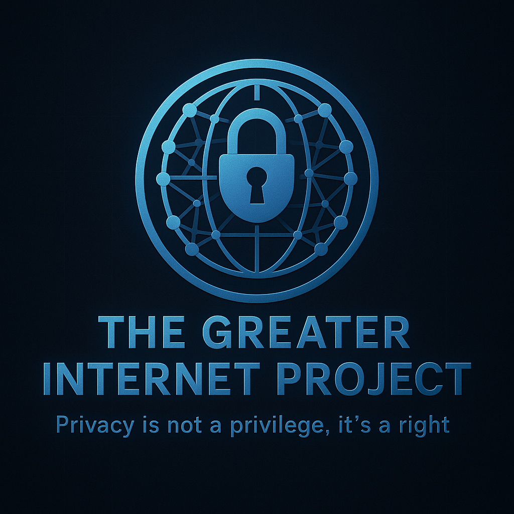

# 🌐 The Greater Internet Project

**A vision for a private, anonymous, and secure future for the Internet.**

  

---

## 📜 Overview

The Greater Internet Project is a conceptual framework designed to **pull the Internet into the future**, emphasizing **privacy, anonymity, and security** for all users.

As we move into the **quantum age**, traditional methods of online communication and data protection face increasing threats. Coupled with widespread surveillance from corporations and governments, many users are left wondering:

> *"Who sees my data? Where is it going? How can I protect myself?"*

The Greater Internet Project aims to address these concerns and **usher in a new era of secure digital freedom**.

---

## 🔐 EDOI — Encrypted Data Over Internet

**Think of it as TLS, but upgraded for the quantum future.**

* **Post-Quantum Encryption:** Ready to resist future quantum attacks.
* **Metadata Encryption:** Not just the content—your IP, timing, and packet size are also hidden.
* **Full-Tunnel Protection:** From the moment you connect to the moment you disconnect, all traffic is encrypted and anonymized.
* **Traffic Obfuscation:** Prevents traffic analysis and fingerprinting.

EDOI forms the **foundational encryption layer** for everything else in the Greater Internet Project.

---

## 🌍 HTTPE — HyperText Transport Protocol Encrypted

**A modern, secure alternative to HTTP.**

* Built **on top of EDOI**.
* **No Downgrade Paths:** Connections are always encrypted—no fallback to HTTP.
* **Encrypted Headers & Metadata**
* **Secure Token Access:** Auth and session data are cryptographically protected.

HTTPE ensures websites and web services can be accessed **safely and uniformly**, without compromising security or privacy.

---

## 🕸️ EDOI-NET — The Shadow Web

**Inspired by Tor, but built from scratch for the modern world.**

* **Distributed DNS:** No central servers; domains are looked up through a node-based distributed hash table.
* **Blockchain-Based CA (Certificate Authority):** Server identity is validated transparently and immutably.
* **Multi-Node Hopping:** Routes are randomized and encrypted; only the last node sees the destination IP.
* **Untraceable Connections:** DNS requests are hashed, encrypted, and passed through multiple nodes to obscure origin and intent.

The Shadow Web is a place where **no one knows who you are, what you access, or where you're going**.

---

## 📘 More Information

The Greater Internet Project is **still in conceptual and early development stages**, but it’s a **call to action**:

> Imagine what the Internet *could* be. Build the future, not just use the present.

Whether it’s through contributions, feedback, or building your own ideas—**you’re invited to be part of that vision**.

---

## 🤝 Contributing

Contributions are welcome!

I'm still a student, so it might take me a little time to review and respond, but **every suggestion, bug report, or PR is appreciated**.

---

## ⚠️ Disclaimer

This project is in **early development / beta**. Expect bugs, crashes, and rough edges.
Spec sheets may be out of date. Code is quite messy and not well commented just yet
Use with caution. Feedback is always welcome.

---

## 📫 Contact

Have ideas, suggestions, or just want to say hi?

Feel free to open an issue or submit a pull request!

---

**“Privacy is not a privilege. It’s a right.”**

---

